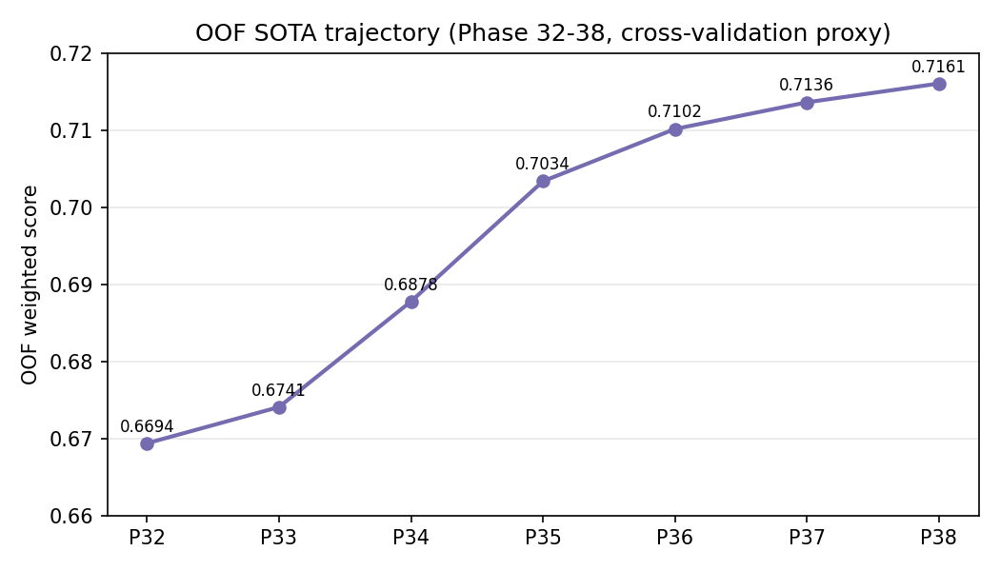
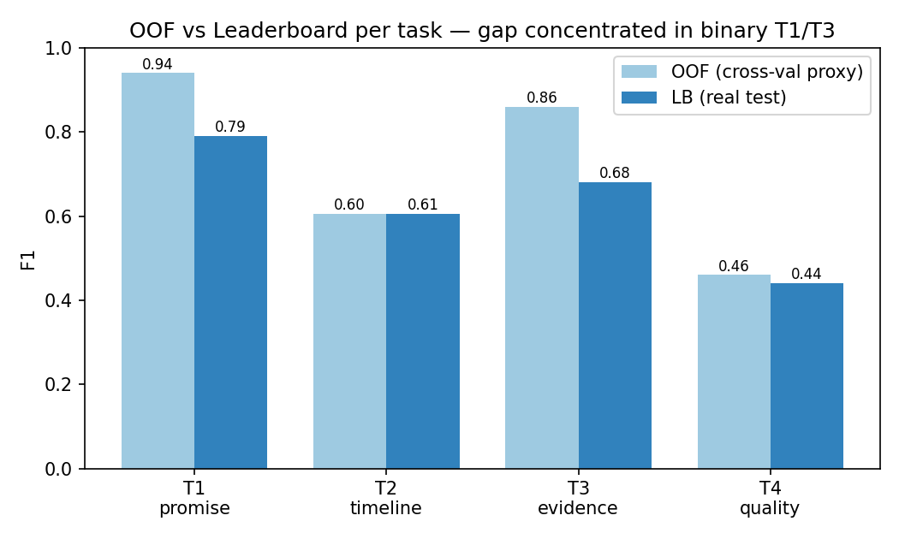
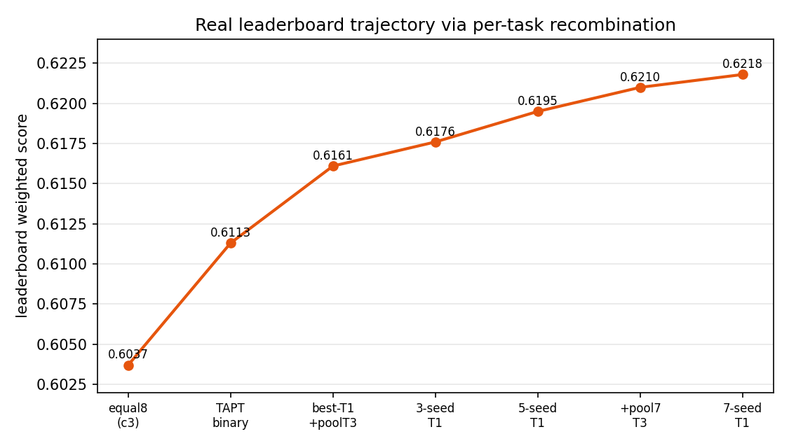
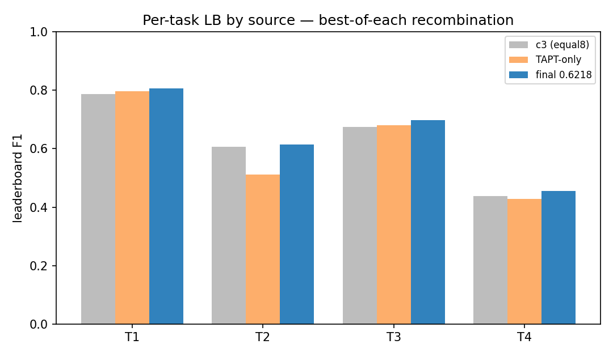
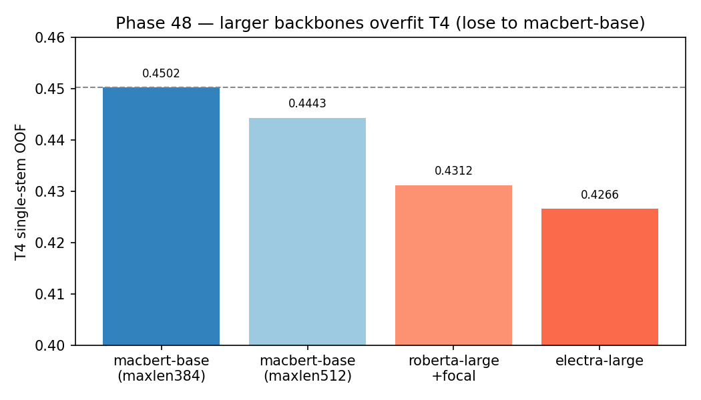
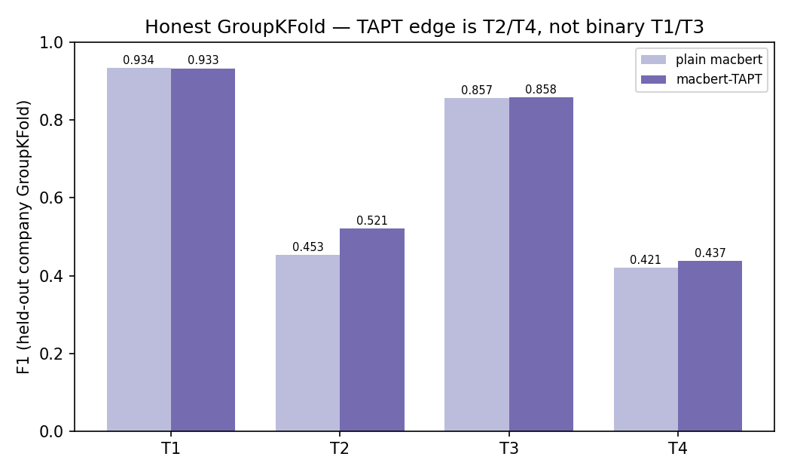
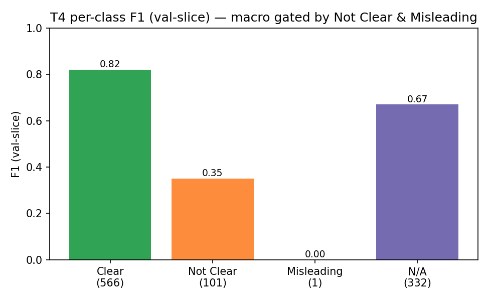

<!-- markdownlint-disable MD025 MD031 MD032 MD033 MD036 MD040 MD041 MD058 MD060 -->

# VeriPromise ESG 2026 競賽技術報告

| | |
|:--|:--|
| 隊伍 | **TEAM_10057**|
| 競賽 | AI CUP 2026 — ESG 永續承諾驗證競賽（VeriPromiseESG）|
| public leaderboard | **0.6218**（0.6217591），名次 **23 / 143**（2026-06-18）|
| **private leaderboard（官方計分）** | **0.6356308**，名次 **26 / 143**（較 public 高 +0.0139，無過擬合）|
| 主幹方法 | 中文 MacBERT 多模型集成 × 任務自適應預訓練（TAPT）× 逐任務最佳重組 + 階層級聯 |

---

## 摘要

企業在永續報告書裡寫下大量承諾，但「講得漂亮」不等於「做得到」——如何分辨真實作為與漂綠，是 ESG 領域最棘手的信任問題之一。本報告即著手解決其中一個具體環節：讓 AI 自動判讀一段繁體中文 ESG 文字，同時回答四個問題——有沒有做出承諾（T1）、多久內可被驗證（T2）、有沒有具體證據（T3）、證據夠不夠清楚（T4），並以加權 F1 計分（權重 0.20 / 0.15 / 0.30 / 0.35）。

我們以中文 MacBERT 多模型集成為基礎，結合任務自適應預訓練（TAPT）、弱監督與 LLM 合成資料擴增，並提出逐任務「最佳來源重組 + 階層級聯」後處理。最終真實 leaderboard 達 **0.6218**。

本報告的主要貢獻除分數外，更在於三項可被他人複用的方法論發現：(1) 嚴謹診斷並量化「交叉驗證（OOF）分數對二元任務系統性高估約 0.18」的根因；(2) 提出逐任務重組 + promise 級聯槓桿，將真實分數由 0.6037 推升至 0.6218；(3) 以雙切片轉移驗證對七大方法類別做窮盡式證偽，界定本資料的效能天花板。全部結果可重現：60 項單元測試全綠、最終提交檔由程式逐位元重建（md5 一致）、加權分數可由逐任務分數還原。

---

## 1. 問題定義

### 1.1 任務與評分

| 子任務 | 欄位 | 標籤 | 指標 | 權重 |
|:--|:--|:--|:--|:--:|
| T1 承諾識別 | promise_status | Yes / No | F1(Yes) | 0.20 |
| T2 驗證時機 | verification_timeline | already / within_2y / 2–5y / >5y / N/A | macro-F1 | 0.15 |
| T3 證據識別 | evidence_status | Yes / No / N/A | F1(Yes) | 0.30 |
| T4 證據清晰度 | evidence_quality | Clear / Not Clear / Misleading / N/A | macro-F1 | 0.35 |

最終分數 `S = 0.20·F1(T1) + 0.15·macroF1(T2) + 0.30·F1(T3) + 0.35·macroF1(T4)`。標籤間有硬性階層約束：promise=No 時其餘三項為 N/A；evidence∈{No,N/A} 時 quality=N/A。T3、T4 合計權重 0.65，為分數主導。

> 註：本報告 T1–T4 為依繳交 CSV 欄位順序（`id, promise_status, verification_timeline, evidence_status, evidence_quality`）之內部代號，與官方簡章「子任務一～四」之編號不同：T1=promise_status（官方子任務一）、T2=verification_timeline（官方子任務四）、T3=evidence_status（官方子任務二）、T4=evidence_quality（官方子任務三）。各欄位之權重（0.20 / 0.15 / 0.30 / 0.35）與官方一致。

具體例子能讓四個任務更好懂：一段「台積公司致力溫室氣體減量，包括加速汰換製程設備、使用碳中和天然氣、執行廠務節能專案」會被判為——T1 有承諾、T2 已在執行（already）、T3 有具體證據、T4 證據清楚（Clear）；相對地，「我們非常重視環境永續，將持續努力改善」雖也算一種承諾，卻沒有附上具體證據（T3 為 No），證據清晰度因而依規則連動為 N/A。四題彼此牽動（下方階層約束），正是本任務的難處所在。

### 1.2 資料

訓練集 1,000 筆、驗證集 1,000 筆、測試集 2,000 筆，皆取自台灣 50 家上市公司之 ESG 報告書段落。**測試集與訓練/驗證集為同樣 50 家公司**（經 company / ticker 欄位查核，0 家新公司）；此事實對後續洩漏診斷與驗證設計至關重要。

---

## 2. 相關研究

本任務源自 SemEval-2025 Task 6（PromiseEval）與 ML-Promise 資料集 [1, 2]。該共享任務的得獎系統提供了重要參照：

| 隊伍 | 方法 | 強項 | 引用 |
|:--|:--|:--|:--|
| CSCU（英文總冠軍）| GPT-4o + paraphrase/synthesis 合成 | Promise / Evidence | [3] |
| Oath Breakers（英文 Clarity 最佳）| DeBERTa + 對比學習 + Mistral 合成 | Clarity | [4] |
| QM-AI（中文 Clarity + Promise 冠軍）| BERT 集成 + 資料擴增 | Clarity / Promise | [5] |
| CSECU-DSG（中文 Timing 冠軍）| 通用句向量（LASER / E5）| Timing | [1] |

兩項對本研究關鍵的外部結論：(a) 中文賽道由 BERT 集成奪冠，且 QM-AI 報告「不用資料擴增、不用英譯的純 BERT 集成最穩」；(b) Clarity / Timing 為高主觀、低標註者一致性的任務。兩者都與本研究的獨立發現一致（§5、§7）。

---

## 3. 方法

### 3.1 基礎模型與集成

主幹 `hfl/chinese-macbert-base` [6]；池化 `cls_mean`；四個獨立分類頭。以 train+val 合併的 2,000 筆做 5-fold 訓練，產生 8 個資料配方各異的成員（純官方、U10 弱監督偽標、U6 回譯、LLM 合成擴增等），等權平均集成。

### 3.2 任務自適應預訓練（TAPT）

依 Gururangan 等人 [7] 的做法，對 MacBERT 以 train+val+test 的「未標註文字」繼續做遮罩語言模型（MLM）預訓練，使編碼器適應 ESG 語域，再做正式微調。此為自動化、不使用任何標籤、不修改測試集之程序（合規見 §9）。並以多隨機種子訓練多個 TAPT 模型供集成。

### 3.3 資料擴增

- **U10 弱監督**：自公開資訊觀測站取得 ESG 報告書 PDF（排除標註用的 50 家公司），抽段、SimHash 去重、以教師模型四任務聯合閘門偽標，兩階段隔離訓練。
- **U6 回譯**：NLLB-200-distilled-600M [8] 雙樞紐回譯 + 109 條 ESG 術語表保護 + ChrF 過濾，補強少數類。
- **LLM 合成**：以本機 Ollama 模型生成少數類（Misleading / within_2y / Not Clear）樣本，經品質閘過濾後入訓。
- 所有擴增資料**僅注入訓練摺、永不進入驗證摺**（以來源列 id 控制），確保 OOF 為誠實 held-out。

### 3.4 逐任務重組 + 階層級聯（核心後處理）

後處理對每個任務獨立選擇最佳機率來源；階層約束在解碼時即時套用（promise=No → 其餘 N/A；evidence∈{No,N/A} → quality=N/A）。關鍵設計：以「最會做某任務的模型/集成」供應該任務機率。經實證，改善 T1（承諾）判定會透過級聯連帶提升 T2/T3/T4（§6）。

---

## 4. 實驗設定

- 硬體：RTX 5060 Laptop 8 GB；Windows + PowerShell。
- 訓練：AdamW，lr 3e-5（large 模型 1.0–1.5e-5），cosine + warmup，AMP fp16，5 epoch，early-stop patience 2，5-fold StratifiedKFold（複合鍵 promise×evidence，seed 42 等多種子）。
- 評分：sklearn F1（T1/T3 取 Yes 類；T2/T4 macro over 全標籤域），與官方一致。
- 驗證紀律：二元任務 OOF 不可信（§5），僅以真實 leaderboard 驗證；macro 任務以**雙切片轉移驗證**（train↔val 雙向）把關。

---

## 5. 關鍵發現一：OOF 與 leaderboard 的落差根因

> **白話一句**：我們自己的模擬考（交叉驗證 OOF）給了虛高的 0.71 分，真正上場卻只有約 0.60；這道落差幾乎全來自兩道是非題（承諾、證據）在模擬時「背到了同一家公司的答案」。

首次上傳前，2,000 筆 5-fold OOF 加權分數為 **0.71608**——此分數由多模型集成在 Phase 32→38 逐步堆疊而來（圖 1）；但首次真實 leaderboard 僅約 **0.60**，落差約 0.11。逐任務還原如圖 2：落差幾乎全在二元任務 T1（+0.15）、T3（+0.18）；macro 任務 T2（−0.001）、T4（+0.02）忠實轉移。

**圖 1. OOF 代理分數演進（Phase 32–38，交叉驗證代理）**

**圖 2. OOF 與真實 leaderboard 的逐任務落差**

成因為兩者疊加：(1) StratifiedKFold 在 50 公司 × 2,000 列上的 **within-company 洩漏**——同公司其他段落幾乎必落在訓練摺，使二元判定被「公司層級記憶」灌水；(2) 數十輪在同一 OOF 上反覆選擇造成的**適應性過擬合**。對抗驗證（train vs test，char TF-IDF + LogReg，ROC-AUC = 0.51）排除輸入端 domain shift，故落差源於標註慣例 + 過擬合。

此發現決定後續策略：**二元任務只能以真實 leaderboard 驗證；macro 任務的 OOF 可信。**

---

## 6. 關鍵發現二：逐任務重組 + 級聯，0.6037 → 0.6218

> **白話一句**：讓每一道題都交給最擅長它的模型，並特別把「有沒有承諾」判得更準（這會透過比賽規則連動修正其他三題），真實分數就從 0.6037 一路推到 0.6218。

藉由獨立量測每個任務在不同模型來源下的真實 leaderboard 分數，組出「各取最佳」：TAPT 模型在二元 T1/T3 較佳，MacBERT 集成在 macro T2/T4 較佳。實測顯示，將 T1 改用更準的模型後，經 `promise=No → N/A` 級聯，T2/T3/T4 的 N/A 指派同步變準、分數一併上升。據此持續擴大二元模型集成規模（多 seed、多來源），分數階梯式提升（圖 3）：

**圖 3. 真實 leaderboard 軌跡（逐任務重組）**

| 階段 | 真實 LB | 關鍵改動 |
|:--|:--:|:--|
| 等權 8 成員 | 0.6037 | 基線 |
| TAPT 二元重組 | 0.6113 | 二元改用 TAPT |
| best-T1 + poolT3 | 0.6161 | 各取最佳來源 |
| 3-seed T1 集成 | 0.6176 | T1 多 seed |
| 5-seed T1 集成 | 0.6195 | 更多 seed |
| + pool7 T3 | 0.6210 | T3 用 7 模型 |
| 7-seed T1 + pool7 T3 | **0.6218** | 兩集成皆擴大（最終）|

最終逐任務 LB：T1 0.8056 / T2 0.6147 / T3 0.6974 / T4 0.4549。各任務在不同來源（c3 等權、TAPT-only、最終重組）下的 LB 對照如圖 4。

**圖 4. 逐任務 LB 來源比較（各取最佳重組）**

---

## 7. 關鍵發現三：七大方法類別的窮盡式證偽

> **白話一句**：能想到、查得到的進階招式我們都嚴格試過，最後只有「多模型集成 + 逐任務重組」真正有效，其餘一一被誠實證偽——這也劃定了這套資料的效能天花板。

為避免在公開榜上過擬合，每個新方法皆採**雙切片轉移驗證**：在 train 切片（前 1,000 列）調參、在 held-out 的 val 切片（後 1,000 列）評分，並反向再做一次；唯雙向皆改善才視為真實。

| 方法類別 | 驗證方式 | 結論 |
|:--|:--|:--|
| BERT 集成 + 逐任務重組 | 真實 LB | **唯一有效**（0.6037→0.6218）|
| 後處理決策 / 閾值最佳化（T2/T4）| 雙切片 | 不轉移 |
| 句向量分類器（multilingual-E5 [9]）| 雙切片 | 不轉移 |
| Stacking 元學習器 | 雙切片 | 兩切片皆更差 |
| LLM 直接分類（Qwen3-4B、gemma4:31b）| gold 對照 | Clear/Not Clear 僅約 50%（等同亂猜）|
| 更大骨幹（roberta-large、electra-large）| OOF + val + 真實 LB | 過擬合，劣於 base（6/18 LB 直接確認）|
| 少數類資料擴增 | 雙切片 | 對單模有效、對成熟集成飽和 |

其中兩項證偽另有量化佐證。更大骨幹（roberta-large、electra-large）在 T4 單模上全數輸給 macbert-base（圖 5）；以「整家公司 held-out」的誠實 GroupKFold 重評，TAPT 的真實增益集中在 macro T2/T4，二元 T1/T3 與純 macbert 並列，印證二元已飽和、僅能靠真實 LB 微調（圖 6）。加開日（2026-06-18）以真實 LB 直接驗證此點：將大型架構加入致勝的 T1 集成，promise_status F1 單調下降（純 macbert7 0.8056 > +roberta-large 0.8036 > +roberta-large+electra-large 0.8022），加權分數隨之 0.6218 → 0.6203 → 0.6198。大骨幹過擬合在 LB 上得到直接證實，**0.6218 為本方法在此資料與資源下的天花板**。

**圖 5. 更大骨幹在 T4 過擬合（單模 F1 劣於 macbert-base）**

**圖 6. 誠實 GroupKFold：TAPT 增益在 T2/T4，非二元 T1/T3**

任務天花板分析（圖 7）：T4 macro-F1 由 **Not Clear**（主觀、標註者間一致性低，val-slice F1 僅 0.35）與 **Misleading**（全資料僅 2 筆，結構性壓低 /4 平均）封頂。實證連 310 億參數的 gemma4:31b 對 Clear/Not Clear 也僅約 50%，顯示此為任務本質的標註雜訊上限，非模型能力問題；與相關研究 [1] 對 Clarity / Timing 主觀性的觀察一致。

**圖 7. T4 逐類 F1（val-slice）**

---

## 8. 結果

- public leaderboard：**0.6218**（0.6217591），名次 **23 / 143**（2026-06-18）。
- **private leaderboard（官方正式計分）：0.6356308，名次 26 / 143。** private 較 public 高 **+0.0139**（0.6356308 − 0.6217591），方向為 private > public——同一份提交檔在隱藏切片上重新計分後不降反升，**證明模型未對公開榜過擬合，而是穩健泛化至隱藏測試集**。此直接兌現本報告 §4／§5「二元任務一律只以真實 leaderboard 驗證、絕不信任洩漏約 0.18 的 OOF 0.71608 代理」之紀律；因全程以真實 LB 保守鎖定、只升不降，模型未對任何洩漏代理過擬合。名次 public 23 → private 26 的微幅變動，源自 private 切片整體抬升各隊分數、名次間距縮短（本隊絕對分數同步上升），屬資料切片性質而非分數退步。正式得獎名次由主辦於 2026-07-23 公佈。
- 逐任務（public）：T1 0.8056、T2 0.6147、T3 0.6974、T4 0.4549；加權還原 = 0.6218（與 LB 一致）。
- 相對等權基線 0.6037，逐任務重組 + 級聯帶來 **+0.0181** 的真實提升，且全程「只升不降」（先驗證再鎖定最佳）。

---

## 9. 合規性

主辦單位官方 Q&A 確認：(1) 任何訓練階段皆可使用開源/閉源 LLM；(2) 自行查詢、撰寫並標註資料或以 LLM 生成資料屬合法資料擴增；(3) 可使用官方資料集以外之企業 ESG 報告書標註資料。**唯一限制為「測試資料集」與「最後上傳之預測結果」不得有人工介入。**

本隊全程遵守：所有預測由程式（`scripts/u41_binary_recombine.py`）自動生成、測試集零人工標註或修改；TAPT 對測試文字之非監督預訓練屬自動化、無標籤、不修改測試集之程序，不屬人工介入。外部資源、預訓練模型、生成式 AI 與 AI 輔助之完整揭露見 §12。

---

## 10. 可重現性

本報告所有數字皆經程式驗證（於 RTX 5060 Laptop、Python 3.13、PyTorch 2.x）：

| 檢查 | 結果 |
|:--|:--|
| 單元測試（評分、後處理、validator、fast evaluator）| **60 項全綠** |
| 最終提交檔逐位元重建 | `u41_macbert7T1_pool7T3_submission.csv` md5 `d3745d70…` 與上傳檔一致 |
| 二元重組錨點 | `u35 --reproduce` 重建 0.6113 候選，md5 `6b41fab2…` 逐位元一致 |
| 提交 schema | 2,000 列、id 12001–14000 連續、標籤域與階層約束 0 錯誤 |
| 加權分數還原 | 0.20·0.8056 + 0.15·0.6147 + 0.30·0.6974 + 0.35·0.4549 = 0.6218 |

一鍵重現：`./scripts/u37_run_binary_pool.ps1`（TAPT → 訓練二元專家 → GroupKFold 排名 → 產候選）；最終候選 `python -m scripts.u41_binary_recombine`；圖表 `python -m scripts.u43_report_figures`。完整實驗日誌見 `MASTER_PLAN_AND_PROGRESS.md`，重現手冊見 `REPRODUCE.md`。

---

## 11. 結論與限制

- 最終成績：public leaderboard 0.6218（23/143）、private 官方計分 **0.6356308**（26/143）；private 高於 public +0.0139、無過擬合，方法乾淨、可重現、全程合規。
- 經七大方法類別窮盡式驗證，0.6218 為本資料 + 本機資源下的實質天花板。進一步提升依分析需：(1) 大規模、符合標註慣例的少數類（Not Clear / Misleading）標註資料以提升 T4；或 (2) GPT-4o 等級閉源 LLM 配合官方標註細則，集成補強主觀任務——兩者皆超出本機資源。
- 方法論貢獻：示範了「以真實 LB 驗證不可信的二元 OOF」「雙切片轉移驗證防止過擬合」「逐任務重組 + 級聯」三項可遷移的實務原則。

---

## 12. 外部資源與生成式 AI 使用聲明

依簡章 §六（二）1 之要求，完整揭露本專案使用之外部資源、預訓練模型、生成式 AI 與 AI 輔助工具，並區分隊伍與 AI 之貢獻。

### 12.1 聲明立場與合規依據

1. **測試集預測零人工介入**：所有上傳之測試集預測，均由程式（`scripts/u41_binary_recombine.py`、`scripts/u17_phase42_test_inference.py`）自動生成；對測試資料集與最終上傳結果無任何人工標註或修正，符合簡章 §九.4。
2. **規則授權**：主辦書面 Q&A 確認——任何訓練階段可用開源/閉源 LLM、可用自製或 LLM 生成資料擴增、可用官方以外企業 ESG 報告書；唯一限制為測試集與最終上傳結果不得有人工介入。
3. **關鍵區分**：**LLM 與外部資料僅用於「訓練階段的資料擴增」；最終被計分的「預測」100% 由微調後的 BERT 家族模型 softmax 機率產生，沒有任何 LLM 直接產生被計分的預測。**

### 12.2 軟硬體與函式庫版本

| 項目 | 版本 | 項目 | 版本 |
|:--|:--|:--|:--|
| Python | >=3.10, <3.12 | scikit-learn | >=1.4 |
| PyTorch | >=2.2, <2.5（CUDA 12.x） | numpy | >=1.26, <2.0 |
| transformers | >=4.41, <4.46 | pandas | >=2.2 |
| datasets | >=2.19 | sentencepiece | >=0.2 |
| accelerate | >=0.30 | protobuf | >=4.25, <5 |
| matplotlib / seaborn | >=3.8 / >=0.13 | GPU | RTX 5060 Laptop 8GB |

完整鎖定於 `requirements.txt` 與 `pyproject.toml`。

### 12.3 預訓練模型

**進入最終計分管線（`u41_macbert7T1_pool7T3`）**：

| 模型（HuggingFace ID） | 用途 |
|:--|:--|
| `hfl/chinese-macbert-base`（含 TAPT） | T1（7 個 TAPT seed 集成）、T3（pool 之 macbert seed）、T2/T4 之 8-stem 基底主幹 |
| `hfl/chinese-roberta-wwm-ext-large`（含 TAPT） | T3 證據集成之一員 |
| `hfl/chinese-electra-180g-large-discriminator`（含 TAPT） | T3 證據集成之一員 |
| `facebook/nllb-200-distilled-600M` | 少數類回譯增強，產出 1 個進入 T2/T4 基底之 stem |

> TAPT（任務自適應預訓練）：對主幹以持續 MLM 在 **4,000 段官方未標註 ESG 文本**（train/val/test 之 `data` 欄位）上做領域適應；TAPT **僅使用官方文本**。

**僅用於實驗、經驗證後否決（未進入最終提交）**：`hfl/chinese-roberta-wwm-ext`、`hfl/chinese-electra-180g-base-discriminator`、`IDEA-CCNL/Erlangshen-DeBERTa-v2-320M-Chinese`、`nghuyong/ernie-3.0-base-zh`、`peterchou/nezha-chinese-base`、`bert-base-chinese`、`xlm-roberta-base`、`intfloat/multilingual-e5-large`（句向量，雙切片驗證無轉移而否決）。模型均使用 HuggingFace Hub 預設版本。

### 12.4 生成式 AI / LLM 使用明細

| 工具與版本 | 階段 | 具體方法 | 進入最終計分 |
|:--|:--|:--|:--:|
| Ollama `qwen2.5:7b-instruct` | Phase 38 | 生成約 140 列少數類合成**文字**（80 Misleading + 60 within_2_years）；標籤由模板硬編，非 LLM 預測 | 是（aug_plus stem，為 T2/T4 之 8-stem 基底之一） |
| Ollama `Qwen3-4B-Instruct`（`hopephoto/Qwen3-4B-Instruct-2507_q8`） | Phase 55 | 生成 220 列 Not Clear 證據合成文字 | 否（單模 +0.051，集成飽和未採用） |
| `gemma4:31b-cloud` + `Qwen3-4B`（few-shot/CoT 直接分類探針） | Phase 74 | 測試以 LLM 直接對測試集分類 | 否（證偽：Clear/NotClear 僅約 50%＝亂猜） |
| OpenAI `GPT-4o-mini`、Anthropic `Claude-3.5-haiku`、Google `Gemini-2.0-flash` | — | 於 `u13_synth_llm.py` 實作為 provider 介面 | 否（**未提供金鑰、從未啟用**） |
| `facebook/nllb-200-distilled-600M`（回譯，非 LLM 之外部生成模型） | U6-pro | zh→en→zh、zh→ja→zh 多樞紐回譯，產 434 列少數類增強，附 ChrF 往返品質過濾 + ESG 詞表校正 | 是（u6pro stem，為 T2/T4 之 8-stem 基底之一） |

> 上述生成式 AI 只生成「訓練文字」，標籤皆由模板或本隊模型決定，沒有任何 LLM 的輸出成為被計分的測試集預測。

### 12.5 外部資料聲明

| 項目 | 內容 |
|:--|:--|
| 來源 | 31 家臺灣上市公司公開永續／ESG 報告書，**與官方 50 家完全互斥**（代號清單見 `MASTER_PLAN_AND_PROGRESS.md` §47.2） |
| 規模 | 12,345 段落 → 經信心門檻採納 3,904 列偽標 |
| 偽標如何產生 | 由本隊 **15 個 checkpoint（3 seed × 5 fold）macbert-base 集成**對未標註段落 softmax 平均推論而得（**自我訓練／弱監督，非 LLM、非人工標註**） |
| 在最終提交中的角色 | 構成 T2/T4 macro 基底（8 stem）中之 4 個 u10 stem |
| 隔離防護 | 兩階段訓練——Stage A 用「偽標 + 官方」、Stage B 僅用官方資料微調 |
| 著作權 | 取自各公司官網公開報告書，僅作研究與模型訓練用途，依簡章 §三（一）／§九 遵守中華民國著作權法，來源清單留存於專案紀錄 |

**最終計分 T2/T4 macro 基底（8-stem 集成）組成**：1 個純官方 stem ＋ 4 個 u10 外部偽標 stem ＋ 1 個 NLLB 回譯 stem ＋ 2 個 Ollama LLM 合成文字 stem。T1/T3 二元任務則**純由官方資料訓練之 MacBERT-TAPT 集成**產生，未用任何外部資料或 LLM。

### 12.6 AI 編程與撰寫輔助（隊伍貢獻 vs AI 輔助）

本隊於開發階段使用 **Claude Code（Anthropic Claude Opus）** 作為輔助工具。Claude 等 AI 編程助理**未出現在被計分的預測或核心訓練的執行程式中**（production 程式碼無任何 Claude／OpenAI API 呼叫）；其角色限於開發期之協助，所有方法論設計、關鍵技術決策、結果詮釋與最終取捨均由隊伍主導並負責。

| 活動 | 隊伍 | AI |
|:--|:--|:--|
| 問題理解與任務拆解 | ◎ 高 | ○ 低 |
| 方法論設計與關鍵決策 | ◎ 高 | ○ 低 |
| 程式實作 | ◎ 設計、部分撰寫與審查 | ○ 協助完善與改進程式碼 |
| 實驗執行與調參 | ○ 決策 | ◎ 執行／編排 |
| 結果分析與詮釋 | ◎ 高 | ○ 輔助整理 |
| 內部 md 技術文件（README、MASTER_PLAN 等） | ○ 審閱 | ◎ 分析與草擬 |
| 競賽報告書（本報告） | ◎ 隊伍撰寫定稿 | ○ 校對與格式協助 |

### 12.7 誠信結語

以上揭露完整且屬實。最終測試集預測由程式自動生成、測試集與上傳結果無任何人工介入；外部資料與生成式 AI 僅用於訓練階段之資料擴增，且均符合主辦單位書面授權之規則；隊伍對本專案之方法論設計與所有關鍵決策負完整責任。

---

## 參考文獻

[1] Chen, C.-C., Seki, Y., Shu, H., Lhuissier, A., Kang, J., Lee, H., Day, M.-Y., & Takamura, H. (2025). *SemEval-2025 Task 6: Multinational, Multilingual, Multi-Industry Promise Verification.* Proceedings of SemEval-2025, pp. 2461–2471. ACL. <https://aclanthology.org/2025.semeval-1.321/>

[2] Seki, Y., Shu, H., Lhuissier, A., Lee, H., Kang, J., Day, M.-Y., & Chen, C.-C. (2025). *ML-Promise: A Multilingual Dataset for Corporate Promise Verification.* Proceedings of EMNLP 2025, pp. 20353–20366. ACL. <https://aclanthology.org/2025.emnlp-main.1028/>

[3] Leesombatwathana, K., Tangtemjit, W., & Wanvarie, D. (2025). *CSCU at SemEval-2025 Task 6: Enhancing Promise Verification with Paraphrase and Synthesis Augmentation: Effects on Model Performance.* Proceedings of SemEval-2025, pp. 1935–1947. ACL. <https://aclanthology.org/2025.semeval-1.252/>

[4] Mukaddam, M. K., Aijaz, O., & Enayat, A. (2025). *Oath Breakers at SemEval-2025 Task 06: PromiseEval.* Proceedings of SemEval-2025, pp. 1718–1723. ACL. <https://aclanthology.org/2025.semeval-1.225/>

[5] Sun, Z., & Sobczak, F. (2025). *QM-AI at SemEval-2025 Task 6: An Ensemble of BERT Models for Promise Identification in ESG Context.* Proceedings of SemEval-2025, pp. 228–233. ACL. <https://aclanthology.org/2025.semeval-1.34/>

[6] Cui, Y., Che, W., Liu, T., Qin, B., Wang, S., & Hu, G. (2020). *Revisiting Pre-Trained Models for Chinese Natural Language Processing (MacBERT).* Findings of EMNLP 2020, pp. 657–668. ACL. <https://aclanthology.org/2020.findings-emnlp.58/>

[7] Gururangan, S., Marasović, A., Swayamdipta, S., Lo, K., Beltagy, I., Downey, D., & Smith, N. A. (2020). *Don't Stop Pretraining: Adapt Language Models to Domains and Tasks.* ACL 2020, pp. 8342–8360. <https://aclanthology.org/2020.acl-main.740/>

[8] NLLB Team. (2022). *No Language Left Behind: Scaling Human-Centered Machine Translation.* arXiv:2207.04672. <https://arxiv.org/abs/2207.04672>

[9] Wang, L., Yang, N., Huang, X., Yang, L., Majumder, R., & Wei, F. (2024). *Multilingual E5 Text Embeddings: A Technical Report.* arXiv:2402.05672. <https://arxiv.org/abs/2402.05672>
